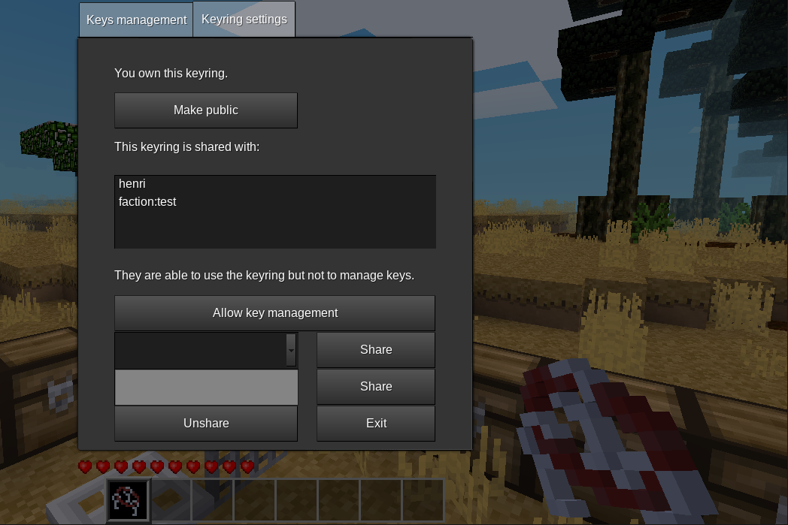

# Keyring

 [](https://content.minetest.net/packages/louisroyer/keyring/) [](https://content.minetest.net/packages/louisroyer/keyring/)

This minetest mod adds keyrings.
Keyrings can be used to store keys.
Once keys are stored in the keyring, keyrings can be used as a regular key.

Personal keyrings are a variant of keyrings allowing to set access and configuration to keys private.

## Craft
### Keyring
```text
empty        group:wire    empty
group:wire   group:key     group:wire
empty        group:wire    empty
```

or
```text
group:key    group:wire   group:key
group:wire   empty        group:wire
group:key    group:wire   group:key
```

This gives back 4 `basic_materials:empty_spool`.
In both crafts, keys (or `group:key`) items will be added to the resulting keyring.



### Personal keyring (shapeless)
- `keyring:keyring`
- `basic_materials:padlock`

### Add a key to the keyring (shapeless)
- `group:key` (`keys:key` or `keyring:keyring`/`keyring:personal_keyring`)
- `keyring:keyring`/`keyring:personal_keyring`

or
- `group:virtual_key`
- `keyring:keyring`/`keyring:personal_keyring`


Notes:
- if you use a personal keyring in the craft, then it must belong to you, else the craft will be forbidden.
- when merging two keyrings, an empty keyring will be returned back

## Dependencies
- [basic_materials](https://github.com/mt-mods/basic_materials)
- keys (from MTG)

## Supported
- default (from MTG): you can automatically select key in the keyring when the interaction check is done with `default.can_interact_with_node`.
- [playerfactions](https://leagueh.xyz/git/playerfactions): you can share a personal keyring with factions using syntax `faction:<faction_name>`.
    - [playerfactions's fork](https://github.com/mt-mods/playerfactions)

## Suggested
- [virtual_key](https://github.com/louisroyer-minetest/virtual-key): you can create virtual keys using a registerer and import them into your keyring; virtual keys is a good way to share access with friends without having to craft a lot of keys or to share a keyring.

## License
- CC0-1.0, Louis Royer 2020-2022

## Settings
- Setting `keyring.personal_keyring` is available to disable/enable personal keyring (enabled by default).
- Setting `keyring.playerfactions` is available to disable/enable the possiblity to share personal keyrings with factions (enabled by default).
- Setting `keyring.override_default_can_interact_with_node` allow to automatically select key in the keyring when the interaction check is done with `default.can_interact_with_node`. This allow better integration with mods like `technic_chests`, where chests interaction is not checked on openning but when moving items.

## Privileges
You can grant the privilege `keyring_inspect` to allow a player to list keys of personal keyrings owned by other players.
