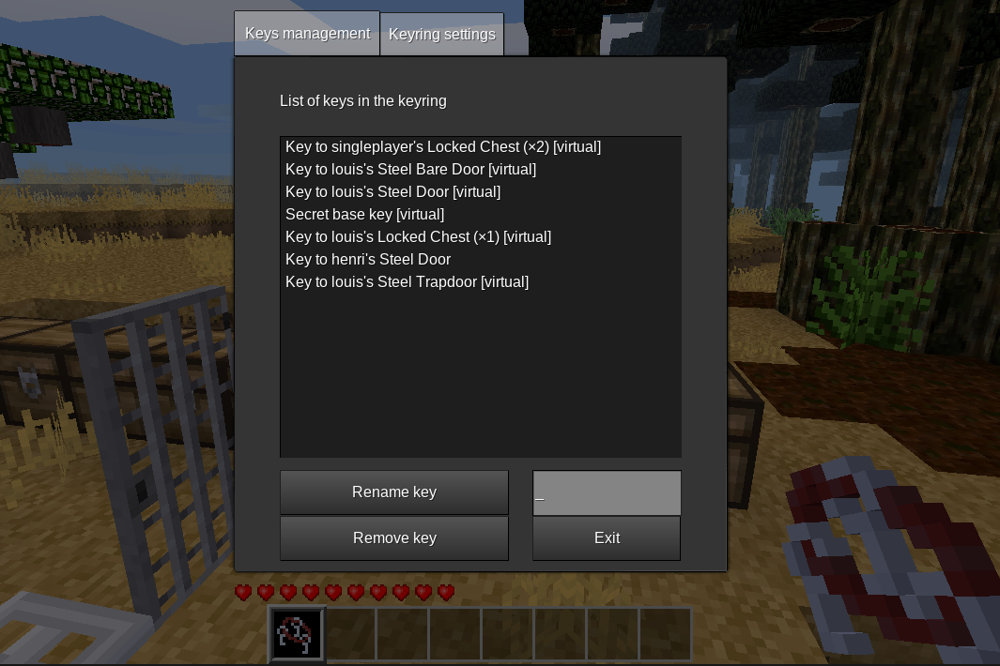

# minetest-keyring [](https://travis-ci.org/louisroyer/minetest-keyring)
**This is still a Work In Progress**

This minetest mod adds keyrings.
Keyrings can be used to store keys with right click.
Once keys are stored in the keyring, they can be used as a regular keys.

## Missing features
- [ ] Keyring texture (current is placeholder)
- [ ] Tests on a multiplayer server
- [ ] Screenshot
- [ ] Set version to 1.0 in init.lua
- [ ] Tag a release and upload to contentdb

## Craft
### Keyring
- wire: `basic_materials:gold_wire`/`basic_materials:copper_wire`/`basic_materials:steel_wire`
- key: `default:key`
```text
empty  wire  empty
wire   key   wire
empty  wire  empty
```

or
```text
group:key wire   group:key
wire      empty  wire
group:key wire   group:key
```

This gives back 4 `basic_materials:empty_spool`.
In both crafts, items keys (or `group:key`) items will be added to the resulting keyring.

### Add a key to the keyring (shapeless)
- `group:key` (`default:key` or `keyring:keyring`)
- `keyring:keyring`


## Dependencies
- [basic_materials](https://gitlab.com/VanessaE/basic_materials)
- default

<!-- -->

## License
- CC0-1.0, Louis Royer 2020
